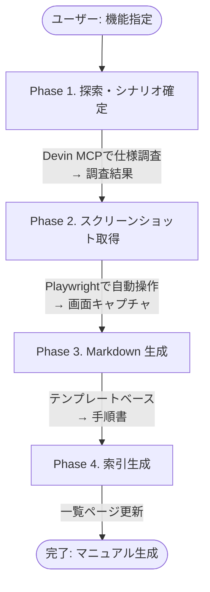

こんにちは。jkkitakitaです。

プロダクトのマニュアル作成って大変じゃないですか？
作成するだけではなくリリースの度に更新しないといけない
しかも、開発とCSの連携がうまくできず、気づいたら変わってるなんてことは、あるあるなんじゃないかなと思っています。
本記事では、以下のような課題を解決する方法を紹介します！

- マニュアル作成に膨大な時間がかかる
- システムの現在の仕様を正確に把握するのが困難
- 最新のスクリーンショットを取得する作業が手間
- マニュアルの更新が後回しになりがち
- マニュアルの品質が安定しない。
- Notion など外部ツールへの依存が管理の負担になる

## 使ったツールと構成

- Cursor
- 以下の MCP サーバーが設定済み
   - Devin MCP（ドキュメント探索用）
      - https://mcp.Devin.ai/
      - https://docs.Devin.ai/work-with-Devin/Devin-mcp
      - API_KEY が必要のため、Core Plan ではなく、Team Plan が必要。
         - https://Devin.ai/pricing
   - playwright mcp（E2E 操作・スクリーンショット撮影用）
   - github mcp
      - 非エンジニアの方でも GitHub の操作を完結させるため。GitHub CLI でも ok
- Git リポジトリ（マニュアル保存先）

:::details Cursor の MCP 設定サンプル
```json
{
  "mcpServers": {
    "deepwiki": {
      "url": "https://mcp.devin.ai/sse",
      "headers": {
        "Authorization": "Bearer YOUR_DEVIN_API_KEY"
      }
    },
    "playwright": {
      "type": "stdio",
      "command": "npx",
      "args": [
        "@playwright/mcp@latest",
      ]
    },
    "github": {
      "url": "https://api.githubcopilot.com/mcp/",
      "headers": {
        "Authorization": "Bearer YOUR_GITHUB_PAT"
      }
    }
  }
}
```
:::

## 全体像

新しい rule は以下の 4 つのフェーズで構成され、すべて Git リポジトリ内で完結します：



1. **Phase 1. 探索・シナリオ確定**：Devin で対象機能の仕様を調査
2. **Phase 2. スクリーンショット取得**：Playwright で自動操作と画面キャプチャ
3. **Phase 3. Markdown 生成**：テンプレートベースで手順書を作成
4. **Phase 4. 索引生成**：プロジェクト単位の一覧ページを更新

## 5分で叩き台：実際に自動化してみた

下記 Cursor Rule を使うと、非エンジニアの方でも、マニュアル作成が完全自動化できました！
無駄に長い気もするので、適宜調整して使ってもらえれば。

:::details manual.mdc
~~~markdown
---
description: マニュアル自動作成
alwaysApply: false
---

# 引数（外から渡す／ユーザー指示から自動抽出）
ARGS:
  PROJECT_NAME: ""   # 例: "顧客管理"（オプション／指示から自動推定可）
  FEATURE_NAME: ""   # 例: "プロジェクトの複製"（オプション／指示から抽出）
  START_POINT: ""    # 例: "グローバルメニューより「プロジェクト」>「一覧」をクリック"（オプション）
  INCLUDE_FIELD_TABLE: false  # 入力項目の表形式説明を含めるか（デフォルト: false）
  USE_PLAYWRIGHT: true         # Playwright でスクショ取得するか（デフォルト: true）

# 目的
プロダクトの特定機能について、探索 → スクリーンショット撮影 → 手順書作成 → 索引生成までを、Cursor のチャットから一気通貫で自動化する。全ての成果物は manuals/ ディレクトリ配下に保存され、Gitで管理される。

# 使う MCP
- Devin mcp（前提知識の探索・質問）
- playwright mcp（E2E操作・スクショ・矩形ハイライト）

# 変数（内部展開）
VARS:
  PROJECT_NAME: "${ARGS.PROJECT_NAME}"                 # ← 外部 args を内部変数へ流し込む（未指定時は推定）
  FEATURE_NAME: "${ARGS.FEATURE_NAME}"                 # 機能名（例: "プロジェクトの複製"）
  FEATURE_SLUG: ""                                      # 機能を表すslug（実行時に生成、例: "login", "project-duplication"）
  MANUAL_DATE: ""                                       # 現在日（YYYY-MM-DD形式、実行時に自動設定、front-matterで使用）
  START_POINT: "${ARGS.START_POINT}"                   # 手順の開始点（指定がある場合）
  INCLUDE_FIELD_TABLE: ${ARGS.INCLUDE_FIELD_TABLE}     # 入力項目表を含めるか
  USE_PLAYWRIGHT: ${ARGS.USE_PLAYWRIGHT}               # Playwright を実行するか
  DOCS_DIR: "manuals/${PROJECT_NAME}"                  # 例: manuals/顧客管理
  FEATURE_DIR: "${DOCS_DIR}/${FEATURE_SLUG}"           # 例: manuals/顧客管理/project-duplication
  IMAGES_DIR: "${FEATURE_DIR}/images"                  # 画像保存先
  PLAYWRIGHT_PROFILE: "default"                        # ログイン済みプロファイル名等（なければ空）
  AUTH_CREDENTIAL_SOURCE: ""                           # 認証情報の取得先（実行時にユーザーに確認）

# 命名規約（厳守）
NAMING:
  MARKDOWN_FILE: "${FEATURE_DIR}/manual.md"
  STEP_IMAGE: "${IMAGES_DIR}/{step}_{slug}.png"
    # step: 2桁ゼロパディング（例: 01, 02, ...）
    # slug: 画面/操作を表す短い名前（kebab-case）
    # 例: images/01_global-menu.png, images/02_project-list.png
  INDEX_FILE: "${DOCS_DIR}/README.md"  # プロジェクト単位の索引ファイル
  SLUG_STYLE: "kebab-case"  # 半角英数字とハイフンのみ

# 成果物（Definition of Done）
DONE:
  - Markdown 手順書（テンプレ準拠）を ${FEATURE_DIR}/manual.md に作成（相対パス画像参照）
  - front-matter にメタデータ（title, project, created, updated）を埋め込む
  - 各 Step でスクリーンショット（raw のみ）を ${IMAGES_DIR} に保存
  - 画像は相対パスで直接参照（例: `./images/01_global-menu.png`）
  - プロジェクト単位の索引ファイル ${INDEX_FILE} を自動生成/更新
  - 既存ファイルとのハッシュ比較により、変更がある場合のみ更新（冪等性確保）
  - 失敗や仕様差分があれば Markdown を更新（正しい手順に修正）
  - ハイライト等の画像編集が必要な場合は、作成者が後で手動で追加

# ガードレール（重要）
GUARDS:
  - 画像は相対パスで参照し、Markdownと同じリポジトリ内に配置
  - スクリーンショットは raw のみを自動取得（ハイライトは作成者が後で手動追加）
  - 画像/文書の既存ファイルはハッシュ比較で差分検出し、変更がある場合のみ更新
  - 個人情報/秘密情報が画面に出る場合はモザイク（矩形ぼかし）に切替
  - 途中で操作が詰まったら Devin へ具体的に質問 → 回答を反映して手順更新
  - 生成物は一貫した日本語で、敬体、用語は製品内表記に合わせる
  - 大量の画像ファイルはGitに含めるため、必要に応じてGit LFSの使用を検討

# フェーズ実行フロー

## Phase 1. 探索・シナリオ確定（Devin）
1. **ユーザー指示の解釈**:
   - `PROJECT_NAME` が未指定の場合、指示文から推定（例: 「顧客管理」「在庫管理」など）。
   - `FEATURE_NAME` を指示文から抽出（例: 「プロジェクトの複製」「ステータスの変更」など）。
   - `START_POINT` が指定されている場合は記録（例: 「グローバルメニューより...」）。
   - `INCLUDE_FIELD_TABLE` フラグを判定（「項目について表形式で」等の記述を検出）。
   - `USE_PLAYWRIGHT` フラグを判定（「推定でも構いません」等の記述で false に設定）。
2. 実行時に `MANUAL_DATE` を現在日付（YYYY-MM-DD形式）に設定。
3. Devin mcp で `${FEATURE_NAME}` の対象機能・仕様を探索:
   - 期待される前提条件・入力、主要ユースケース、制約、エラーケース、ロール/権限。
   - 画面遷移の要点、操作の落とし穴（非同期・検証・ロール制御・表示条件）。
   - **入力項目の詳細仕様**（`INCLUDE_FIELD_TABLE` が true の場合）:
     - 項目名、必須/任意、説明、入力形式、制約条件、デフォルト値。
   - **選択条件・ビジネスルール**:
     - 例: 「複製元プロジェクトはどんな条件で選択できるのか」等の仕様詳細。
     - 状態遷移ルール、権限による制御、表示条件など。
4. 機能名から適切な `FEATURE_SLUG` を決定（kebab-case、例: "project-duplication", "status-update"）。
5. 重要ポイントを **要点箇条書き**でまとめ、後続の「手順の見出し」を先に設計する。
6. 不明点が残る場合は Devin に **具体的に**質問し、回答をメモに追記。

## Phase 2. スクリーンショット取得（playwright）

**`USE_PLAYWRIGHT` が true の場合のみ実行。false の場合はこのPhaseをスキップし、Phase 3 へ進む。**

1. 認証情報の取得:
   - ユーザーに認証情報の取得方法を確認（例: ログイン済みのプロファイル、環境変数など）。
   - `${AUTH_CREDENTIAL_SOURCE}` を設定。
2. playwright mcp で対象URLへアクセス。必要なら `${PLAYWRIGHT_PROFILE}` を使用。
3. 各ステップごとに:
   - 画面遷移 → 要素待機（明示的 wait / assert）→ スクショ保存。
   - 画像ファイルは `${IMAGES_DIR}/{step}_{slug}.png` 形式で保存。
   - step は2桁ゼロパディング（01, 02, ...）、slug はkebab-case。
   - 既存ファイルのハッシュ比較を行い、変更がある場合のみ更新。
   - ハイライト等の画像編集は行わない（作成者が後で必要に応じて追加）。
4. 手順通りに動かない・UI差異がある場合:
   - Devin mcp へ 発生事象＋期待動作＋前後文脈 を投げて解決策を得る。
   - 解決後、手順メモを更新（Phase 3 で Markdown に反映）。

**`USE_PLAYWRIGHT` が false の場合:**
- Phase 1 の探索情報と `START_POINT` の指示に基づいて手順を推定。
- 画像は後で手動追加する前提でMarkdown生成を進める。

## Phase 3. Markdown生成
1. `${FEATURE_DIR}` ディレクトリを作成（既存の場合は更新モード）。
2. Phase 1 の要点と Phase 2 の操作ログに基づいて `${MARKDOWN_FILE}` を生成:
   - **front-matter の設定**:
     - **新規作成時**: created と updated に `${MANUAL_DATE}`（現在日）を設定。
     - **更新時**: 既存の created を維持、updated のみを `${MANUAL_DATE}`（現在日）に更新。
   - テンプレートに従って本文を作成。
   - 画像は相対パスで直接参照（例: `./images/01_global-menu.png`）。
3. 既存ファイルと差分比較し、変更がある場合のみ更新（冪等性確保）。
4. 失敗や仕様差分があれば即座に修正（正しい手順で上書き）。

### Markdownテンプレート
```markdown
---
title: ${機能名}
project: ${PROJECT_NAME}
created: ${MANUAL_DATE}
updated: ${MANUAL_DATE}
---

# ${機能名} - ${PROJECT_NAME}

## 概要
このドキュメントは、${PROJECT_NAME} の「${機能名}」に関する操作手順を説明します。

## 前提条件
1. 権限：〜〜
2. 環境：〜〜
3. 注意：〜〜

## 入力項目
**`INCLUDE_FIELD_TABLE` が true の場合のみ含める**

| 項目 | 必須 | 説明 | 入力形式 |
|------|------|------|----------|
| ${項目名} | ○/- | ${項目の説明} | ${入力形式・制約} |
| ... | ... | ... | ... |

## 仕様詳細
**選択条件やビジネスルールがある場合に含める**

### ${仕様項目名}（例: 複製元プロジェクトの選択条件）
- ${詳細な仕様説明}
- ${制約条件やルール}

## 手順

### 1. ${STEP_TITLE}
${ACTION_SENTENCE}（画面: ${SCREEN_NAME}）


### 2. ...

## 注意事項
- 〜〜
```

### マニュアルサンプル
```markdown
---
title: プロジェクトの複製
project: 顧客管理
created: 2025-09-28
updated: 2025-10-03
---

# プロジェクトの複製 - 顧客管理

## 概要
既存のプロジェクトを基に、新しいプロジェクトを複製作成する手順を説明します。

## 前提条件
1. ユーザーにプロジェクト作成の権限があること。
2. 複製元となるプロジェクトが選択可能な状態であること。
3. 複製には、元プロジェクトの設定やデータが引き継がれます。

## 入力項目

| 項目 | 必須 | 説明 | 入力形式 |
|------|------|------|----------|
| プロジェクト名 | ○ | 新規作成するプロジェクトの名称 | テキスト（最大100文字） |
| プロジェクトコード | ○ | プロジェクトを識別するコード | 半角英数字（8桁） |
| 複製元プロジェクト | ○ | コピー元となるプロジェクトを選択 | プルダウン選択 |
| 開始日 | ○ | プロジェクトの開始予定日 | 日付（YYYY-MM-DD形式） |
| 備考 | - | プロジェクトに関する補足情報 | テキスト（最大500文字） |

## 仕様詳細

### 複製元プロジェクトの選択条件
- 選択可能なプロジェクトは、以下の条件を満たすもののみ表示されます:
  - 完了または進行中の状態であること
  - ユーザーが参照権限を持つプロジェクトであること
- 複製元プロジェクトを選択すると、以下の情報が新規プロジェクトに引き継がれます:
  - タスクとマイルストーンの設定
  - プロジェクトの説明文・目的
  - 担当部署・担当者の情報（権限がある場合）

### データ引き継ぎルール
- タスクは未完了の状態で初期化されます
- 複製作成後も、元プロジェクトへの参照関係が保持されます
- 複製元プロジェクトが削除されても、複製されたプロジェクトには影響しません

## 手順

### 1. プロジェクト一覧画面への遷移
グローバルメニューより「プロジェクト」>「一覧」をクリックします。<プロジェクト一覧>画面に遷移します。


### 2. 新規プロジェクト作成ボタンをクリック
プロジェクト一覧画面の右上にある「新規作成」ボタンをクリックします。作成方法選択のモーダルが表示されます。


### 3. 複製を選択
モーダル内で「既存プロジェクトを複製」を選択します。複製フォームに遷移します。


### 4. 複製元プロジェクトを選択
「複製元プロジェクト」のプルダウンから、コピー元となるプロジェクトを選択します。選択可能なプロジェクトは、完了または進行中のプロジェクトのみが表示されます。


### 5. プロジェクト情報を入力
必須項目（プロジェクト名、プロジェクトコード、開始日）を入力します。複製元プロジェクトの情報が一部自動で引き継がれます。


### 6. 保存して確認
「保存」ボタンをクリックします。保存後、作成されたプロジェクトの詳細画面に遷移し、複製元プロジェクトの情報が正しく引き継がれていることを確認します。


## 注意事項
- 複製元プロジェクトの選択肢は、ユーザーの権限とプロジェクトの状態により制限されます。
- 複製時に引き継がれるデータは、複製元プロジェクトの設定により異なる場合があります。
- 保存後の修正は、通常のプロジェクト編集機能を使用してください。
```

## Phase 4. 索引生成
1. `${DOCS_DIR}` 配下の全マニュアルを走査:
   - 各 `manual.md` の front-matter から title, created, updated を抽出。
   - ファイルパスを相対パスで記録。
2. `${INDEX_FILE}` を生成/更新:
   - 表形式で一覧を作成（作成日、更新日、機能名、パス）。
   - 更新日降順でソート（最近更新されたものが上）。
3. 既存ファイルと差分比較し、変更がある場合のみ更新。

### 索引ファイルサンプル
```markdown
# ${PROJECT_NAME} マニュアル一覧

| 作成日 | 更新日 | 機能名 | パス |
|--------|--------|--------|------|
| 2025-09-28 | 2025-10-01 | ユーザー管理 | [manual.md](user-management/manual.md) |
| 2025-10-01 | 2025-10-01 | ステータスの一括変更 | [manual.md](status-bulk-update/manual.md) |
```

## 実装の指針（自動化のコツ）

### ユーザー指示の解釈（Phase 1 の前処理）
* ユーザーの指示文から以下を自動抽出・推定:
  - **PROJECT_NAME**: 「顧客管理」「在庫管理」などのプロジェクト名キーワードを検出
  - **FEATURE_NAME**: 「〜について」「〜の手順」などから機能名を抽出
  - **START_POINT**: 「〜からスタートしてください」「〜より開始」などの明示的な指示
  - **INCLUDE_FIELD_TABLE**: 「項目について表形式で」「項目、必須、説明、入力形式」などの記述を検出
  - **USE_PLAYWRIGHT**: 「推定でも構いません」「スクショ不要」などで false に設定、デフォルトは true
* 抽出した情報を Phase 1 の冒頭でユーザーに確認（必要に応じて）

### MCP ツールの活用
* まず 利用可能な MCP のツール一覧を列挙し、各フェーズで使うツール名/引数を明記してから実行する。
* Devin での探索時は、ユーザーの具体的な質問（例: 「複製元プロジェクトはどんな条件で選択できるのか」）を必ずクエリに含める。

### Playwright の実行（USE_PLAYWRIGHT が true の場合）
* Playwright のステップは「要素のセレクタ指定 → 可視化待機 → アクション → 期待状態の assert」の順を徹底。
* 画像の SLUG は画面やコンポーネント名を簡潔に（例: global-menu, create-button, select-duplication）。

### 冪等性とエラーハンドリング
* 再実行を想定し、各フェーズは冪等に：既存ファイルのハッシュ比較、変更がある場合のみ更新。
* **マスタードキュメント方式**: 同じ機能名で再度実行すると、既存マニュアルを更新（created は維持、updated のみ更新）。
* 途中で例外が出たら、どのフェーズのどのステップで何が起きたかを短くログしてから次の手を打つ（Devin 相談 or リトライ）。
* 全成果物はGitで管理されるため、コミットメッセージは明確に（例: "Add manual for プロジェクトの複製" または "Update manual for プロジェクトの複製"）。

## 最終チェックリスト
* Markdown に欠番の Step がない
* front-matter にメタデータ（title, project, created, updated）が正しく設定されている
* すべての画像リンクが相対パスで解決できる
* 画像ファイル名が命名規則に従っている（{step}_{slug}.png）
* プロジェクト単位の索引ファイル（README.md）が更新されている
* 誤字・表記ゆれ（機能名・メニュー名）がない
* 注意事項に既知の制約・ロール制御・エラー条件を記載済み

## ちょい改善ポイント（実務で効きます）
* **要素選択**：`role=button[name="保存"]` のように **アクセシビリティセレクタ**優先。アイコンだけのボタンは `aria-label` を付与しておくとテスト/撮影が楽。
* **再実行耐性**：ハッシュ比較により、同じ内容のファイルは再生成しない。
* **差分更新**：スクショを撮り直した場合、Markdown への参照名は変えず、**ファイル差し替え**で履歴を綺麗に。
* **画像編集**：ハイライト等が必要な場合は、作成者が後で手動で画像を編集・追加する。画像編集ツール（例: Skitch, Annotate等）を活用。
* **Git管理**：マニュアル更新時は適切なコミットメッセージでコミットし、変更履歴を明確に保つ。
~~~
:::

この rule を使って、Cursor の Chat で以下のように指示するだけ。

```markdown
@manual.mdc 
プロジェクトの複製について、グローバルメニューの遷移から説明する操作説明マニュアルの文章を作成してください。
なお、項目については汎用的な説明を表形式で入れてください。
項目の説明の表は、項目、必須、説明、入力形式の順番で作成してください
操作のステップは推定でも構いません、グローバルメニューより「プロジェクト」＞「一覧」をクリックします。＜プロジェクト一覧＞画面に遷移します。からスタートしてください。

複製元プロジェクトはどんな条件で選択できるのか等の詳細な仕様も含めて記載ください。
画像も取得して。
<URL>
```

最終的に以下のようなファイルが生成されます。

```
manuals/
├── 顧客管理/
│   ├── README.md                      # 索引ファイル
│   ├── project-duplication/           # 機能ごとのディレクトリ
│   │   ├── manual.md                  # 手順書本体
│   │   └── images/
│   │       ├── 01_global-menu.png
│   │       ├── 02_create-button.png
│   │       └── ...
│   └── status-update/
│       ├── manual.md
│       └── images/
│           └── ...
└── 在庫管理/
    └── ...
```

## Cursor Rule について

詳細は実際の rule をみてもらえればと思いますが、それぞれの Phase について簡単に説明します。

### Phase 1. 探索・シナリオ確定

1. Devin MCP（ask_question） を活用して、対象機能の仕様を徹底的に調査します
2. ここで調査した内容・手順を元に、Phase 2. のスクリーンショット取得をします。

### Phase 2. スクリーンショット取得

1. 指示した URL にアクセスして、Phase 1. の内容を元にスクリーンショットを取得します。
2. ログインが必要な場合、認証情報は、別途 Chat などで渡すなどする必要があります。
3. 実際に Playwright で操作してみて、Devin の結果に誤りがあった場合、再度 Devin に質問したり、実際に操作したりして、Phase 3. のマニュアル作成も修正した結果で出力します。

### Phase 3. Markdown 生成

1. テンプレートベースで構造化された手順書を生成します。
2. 既存ファイルとハッシュ比較し、変更がある場合のみ更新
3. **マスタードキュメント方式**: 同じ機能で再実行すると、created は維持し updated のみ更新

### Phase 4. 索引生成

1. プロジェクト単位で一覧ページを自動生成・更新します

```markdown
# 顧客管理 マニュアル一覧

| 作成日 | 更新日 | 機能名 | パス |
|--------|--------|--------|------|
| 2025-09-28 | 2025-10-03 | プロジェクトの複製 | [manual.md](project-duplication/manual.md) |
| 2025-10-01 | 2025-10-01 | ステータスの一括変更 | [manual.md](status-bulk-update/manual.md) |
```

## 得られた価値

- **マニュアル作成に膨大な時間がかかる**
  → 30〜60分かかっていた叩き台作成が、わずか5分で非同期に完了

- **システムの現在の仕様を正確に把握するのが困難**
  → Devin が実際のコードを参照しながら仕様を調査

- **最新のスクリーンショットを取得する作業が手間**
  → Playwright で自動取得が可能

- **マニュアルの更新が後回しになりがち**
  → リリース時に影響のある手順を指定するだけで更新完了

- **マニュアルの品質が安定しない**
  → Devin による仕様調査で抜け漏れを防止し、属人化を解消

- **Notion など外部ツールへの依存が管理の負担になる**
  → Git/GitHub でシンプルかつ柔軟に管理

## さいごに

マニュアル作成の自動化により、これまで手間のかかっていた作業が大幅に効率化されました。同じ課題を抱えている方は、ぜひこの方法を試してみてください。

今後は以下のような発展も検討しています：

- **Cursor の Background Agent を活用した自動化の強化**
  - マニュアルの作成・更新をさらに効率化

- **マニュアルを活用したドキュメントサイトの構築**
  - 作成したマニュアルを元にヘルプサイトやドキュメントサイトを展開
